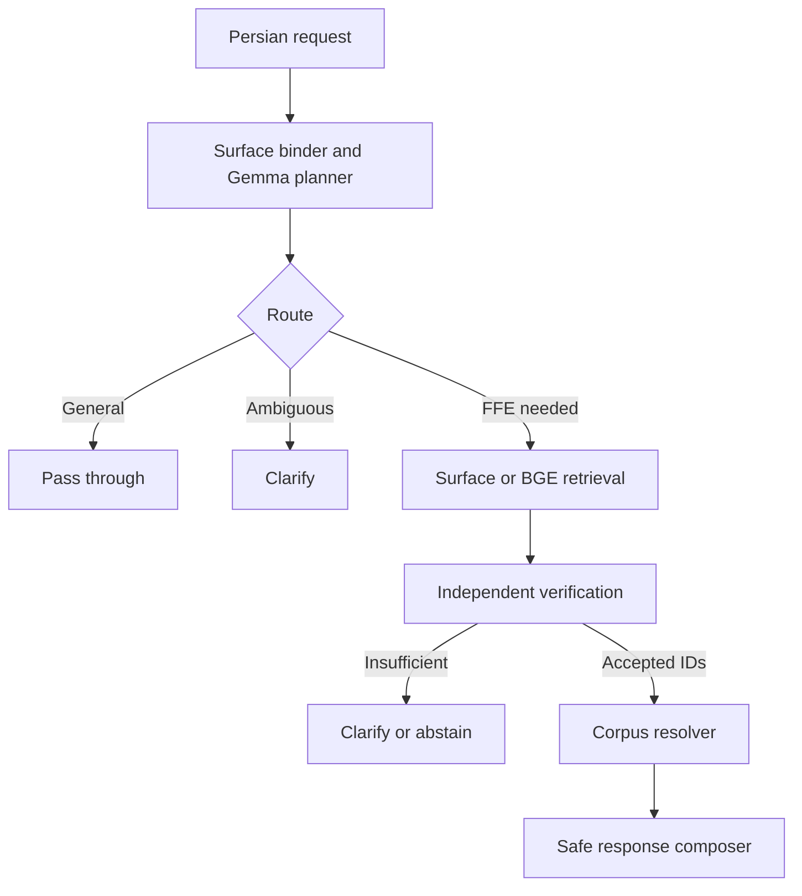

# Persian Proverbs and Fixed Expressions Assistant

PPQ is a corpus-grounded assistant for retrieving, restoring, validating, and
explaining Persian fixed figurative expressions. Its central safety rule is
simple: the wording shown as an authentic proverb or idiom must be resolved from
the reviewed corpus; the language model cannot invent that wording.

This repository is the final implementation of Mahdiar Harandi's Computer
Engineering bachelor's project, supervised by Prof. Yadollah Yaghoobzadeh at
the University of Tehran.

## Recognition

**Best Undergraduate Project Award**, Project Day, Faculty of Electrical and
Computer Engineering, University of Tehran, 2026.

## At a glance

- **Problem:** language models may invent or alter Persian proverbs and idioms.
- **Approach:** interpret requests with Gemma, retrieve with BGE-M3, verify
  candidates, and quote the exact wording from a reviewed corpus.
- **Data:** 1,820 expression families and 2,067 attested variants.
- **Evaluation:** 81% end-to-end accuracy on 200 prompts. In a separate blind
  comparison of 185 prompts, fabricated or unattested responses were 1.08%
  for this system and 31.35% for base Gemma.
- **Interface:** a Persian right-to-left Gradio application and command-line tools.

## Project scope

General-purpose language models may fabricate plausible-looking proverbs,
combine nearby variants, or silently change culturally fixed wording. PPQ uses
Gemma for structured request understanding and controlled surrounding prose,
BGE-M3 for semantic candidate retrieval, and independent verification before a
corpus record can reach the response.

The included frozen assets contain:

| Asset | Count |
| --- | ---: |
| Reviewed expression families | 1,820 |
| Attested surface variants | 2,067 |
| Families with a standardized gloss | 1,820 |
| Sealed practical benchmark prompts | 200 |

Supported operations include surface completion, noisy-form restoration,
corpus-bounded attestation, explanation, meaning/scenario search, multi-example
retrieval, clarification, abstention, and pass-through of general requests.

## Architecture



Key invariants:

1. Dense similarity proposes candidates; it never authorizes semantic acceptance.
2. Attestation checks complete normalized corpus variants, not fuzzy similarity.
3. Accepted expression IDs are resolved through `Corpus.resolve()`.
4. Uncertain requests fail closed as `CLARIFY`, `ABSTAIN`, or bounded non-attestation.
5. General requests remain outside the specialized PPQ component.

## Models and frozen revisions

| Component | Model | Revision |
| --- | --- | --- |
| Planner and response composer | `google/gemma-4-E4B-it` | `ee0ef6023621cff504d758262d4e04895a5af4a2` |
| Semantic query encoder | `BAAI/bge-m3` | `5617a9f61b028005a4858fdac845db406aefb181` |

`artifacts/family_embeddings.npy` contains the precomputed family embeddings.
Runtime semantic search encodes only the incoming query and verifies the corpus
hash, family order, vector dimensions, model ID, revision, and embedding hash.

## Repository layout

```text
ppq-bachelor-project/
├── artifacts/                 # Frozen BGE-M3 vectors and integrity metadata
├── data/
│   ├── benchmark/             # Sealed 200-prompt benchmark and manifest
│   └── corpus/                # Expressions, variants, glosses, and sources
├── docs/                      # Persian evaluation guide
├── results/
│   ├── benchmark/             # Frozen automatic and blind A/B results
│   └── performance/           # Final latency and quality summary
├── scripts/
│   ├── evaluation/            # Benchmark, profiling, analysis, and figures
│   ├── interactive.py         # Persistent terminal session
│   ├── run.py                 # One request from the command line
│   └── ui.py                  # Persian RTL Gradio interface
├── src/ppq/                   # Runtime implementation
├── tests/                     # Integrity and regression tests
├── pyproject.toml
└── requirements.txt
```

Generated reruns are written to `evaluation-output/` by default, so the frozen
files under `results/` are not overwritten accidentally.

## Environment

- Python 3.12
- Linux recommended
- CUDA-capable GPU for Gemma 4; the validated configuration used two Tesla T4
  GPUs with 16 GB memory each
- Hugging Face access to the pinned model repositories

The `--embedding-device cpu` option moves only BGE-M3 query encoding to CPU.
Gemma still requires CUDA.

## Installation

```bash
python -m venv .venv
source .venv/bin/activate
python -m pip install --upgrade pip
python -m pip install -e .
```

For tests and evaluation figures:

```bash
python -m pip install -e ".[test,evaluation]"
```

On Windows, activate the environment with `.venv\Scripts\activate`. Authenticate
with `hf auth login` or provide `HF_TOKEN` if model access requires it.

## Running PPQ

Web interface:

```bash
export PYTORCH_CUDA_ALLOC_CONF=expandable_segments:True
python scripts/ui.py
```

Open `http://127.0.0.1:7860`. Use `--port 7861` for another port or `--share`
for a temporary public Gradio URL. A shared URL is public for its lifetime.

Single command-line request:

```bash
python scripts/run.py "شکل کامل ضرب‌المثل کوه به کوه نمی‌رسد را بگو"
```

Persistent console session:

```bash
python scripts/interactive.py
```

Enter `/exit` or `/quit` to close the session.

## Response decisions

| Decision | Meaning |
| --- | --- |
| `COMPOSED` | Response composed from verified corpus evidence |
| `PASS_THROUGH` | No Persian fixed expression is required |
| `CLARIFY` | The requested target or operation is ambiguous |
| `ABSTAIN` | Evidence is insufficient for a safe answer |
| `NOT_ATTESTED_IN_CURRENT_CORPUS` | Wording was not found in this corpus; this is not proof of linguistic impossibility |

PPQ is a specialized component rather than a complete general-purpose chatbot.
The standalone UI reports pass-through decisions but does not generate an
unrelated general answer.

## Final evaluation results

The sealed benchmark contains 200 unique prompts across 13 categories.

| Automatic metric | Result |
| --- | ---: |
| Route accuracy | 97.00% |
| Action accuracy | 94.50% |
| Runtime decision accuracy | 87.00% |
| Response decision accuracy | 86.50% |
| Family accuracy | 82.58% (128/155) |
| End-to-end accuracy | 81.00% (162/200) |

The condition-blind A/B review contains 185 comparable prompts:

| Metric | PPQ | Base Gemma |
| --- | ---: | ---: |
| Task fulfilled | 80.00% | 20.00% |
| Authentic | 99.37% (157/158) | 45.16% (56/124) |
| Appropriate | 97.47% (154/158) | 55.49% (91/164) |
| Fabricated/unattested | 1.08% | 31.35% |

Pairwise preference was 167 PPQ, 11 base Gemma, and 7 ties: a 93.82% PPQ win
rate among decisive comparisons. Authenticity and appropriateness exclude `NA`,
so their denominators differ by system.

Median latency was 29.287 s for base Gemma and 17.589 s for PPQ in the recorded
run, while PPQ had a much heavier P95 tail (114.912 s versus 31.737 s). These
measurements must not be summarized as “PPQ is always faster.” Authoritative
artifacts are under `results/benchmark/` and `results/performance/`.

## Reproduction and tests

Run deterministic preflight checks:

```bash
python -m scripts.evaluation.preflight
```

Run the complete test suite:

```bash
python -m pytest -q
```

Run a new PPQ-versus-base benchmark in the non-frozen output directory:

```bash
python -m scripts.evaluation.run_benchmark
```

Aggregate a completed blind review:

```bash
python -m scripts.evaluation.summarize_blind_review
```

For paired latency measurement, stage profiling, and figure generation, follow
[`docs/evaluation-guide-fa.md`](docs/evaluation-guide-fa.md). Do not tune prompts,
thresholds, corpus records, or verifier budgets using the sealed test results and
then report the same benchmark as untouched.

## Scope and data note

- Authenticity claims are bounded by the included reviewed corpus and its sources.
- Semantic retrieval can miss rare, underspecified, or low-overlap situations.
- Fixed-expression wording is corpus-resolved; ordinary explanatory prose can be
  model-composed and is separately constrained and validated.
- Source provenance, snapshot, review status, and license tags are recorded in
  `data/corpus/sources.jsonl`.
- The repository has no project-wide software license. Do not assume redistribution
  rights beyond the source-specific metadata.

## Research context

The implementation addresses the figurative-hallucination problem described by
Faezeh Hosseini, Mohammadali Yousefzadeh, and Yadollah Yaghoobzadeh in
“FFE-Hallu: Hallucinations in Fixed Figurative Expressions: Benchmark of Idioms
and Proverbs in the Persian Language” (arXiv:2601.20105v1, 2026), and follows the
project proposal's requirement for reliable retrieval, exact quotation,
clarification, and abstention under insufficient evidence.
